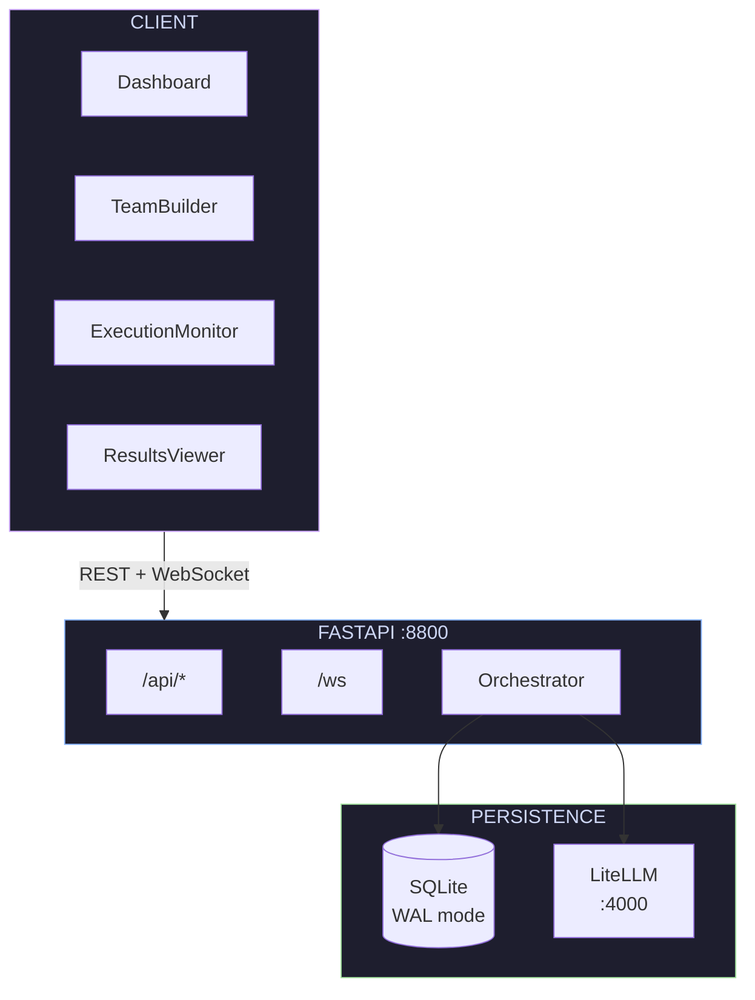
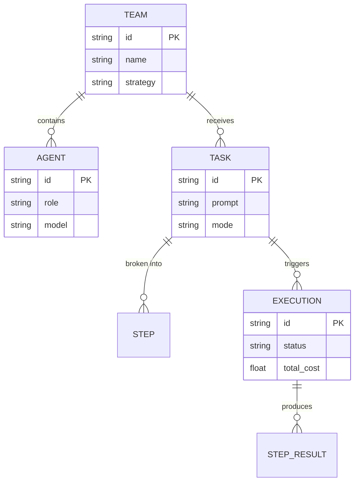

> **DEPRECATED** — This repository has been consolidated into [mdo-nexus-ooda](https://github.com/hugefisco94/mdo-nexus-ooda). No further updates here.

<div align="center">

# N E X U S

**Orchestrate multi-model AI agent teams. Observe every decision in real time.**

<br/>

<a href="https://github.com/hugefisco94/nexus/releases/latest">
  
</a>
<a href="https://github.com/hugefisco94/nexus/blob/master/LICENSE">
  
</a>
<a href="https://github.com/hugefisco94/nexus/pulse">
  
</a>
<a href="https://github.com/hugefisco94/nexus/stargazers">
  
</a>

<br/><br/>

<a href="#quick-start">Quick Start</a>&nbsp;&nbsp;&bull;&nbsp;&nbsp;<a href="#architecture">Architecture</a>&nbsp;&nbsp;&bull;&nbsp;&nbsp;<a href="#api-reference">API</a>&nbsp;&nbsp;&bull;&nbsp;&nbsp;<a href="https://github.com/hugefisco94/nexus/releases">Releases</a>

<br/>


</div>

<br/>

<p align="center"><em>"Humans steer. Agents execute."</em></p>

---

## Why Nexus

Nexus gives you a single control surface for multi-model AI agent teams. Define a team of specialist models, assign each a role, then launch tasks and watch execution unfold in real time through WebSocket-driven dashboards.

One endpoint provisions a battle-tested five-agent team. One command deploys the entire stack.

<br/>

<table>
<tr>
<td width="25%" align="center"><strong>Compose</strong><br/><sub>Build teams with role-specific models</sub></td>
<td width="25%" align="center"><strong>Execute</strong><br/><sub>Parallel &amp; sequential pipelines</sub></td>
<td width="25%" align="center"><strong>Observe</strong><br/><sub>Live WebSocket execution feed</sub></td>
<td width="25%" align="center"><strong>Analyze</strong><br/><sub>Tokens, cost, latency per agent</sub></td>
</tr>
</table>

<br/>

## Architecture



<br/>

### Data Model



<br/>

### Harness Engineering Preset

A single `POST /api/teams/preset/harness` provisions the reference team:

| Role | Model | Responsibility |
|:-----|:------|:---------------|
| **Orchestrator** | `claude-opus-4-6` | Decomposition, delegation, judgment |
| **Backend** | `gpt-5.3-codex` | Logic, review, refactoring |
| **Actor** | `claude-sonnet-4-6` | Primary code generation |
| **Security** | `qwen3-coder` | Vulnerability analysis |
| **Designer** | `gemini-3.1-pro` | UI evaluation, visual judgment |

<br/>

## Quick Start

### Docker &mdash; recommended

```bash
docker compose up -d
```

Frontend on `:3000` &middot; Backend on `:8800`

### Manual

```bash
# backend
cd backend && pip install -e ".[dev]"
uvicorn src.main:app --port 8800 --reload

# frontend
cd frontend && npm install && npm run dev
```

Open `http://localhost:5173` &mdash; API proxied automatically.

> **Optional** &mdash; connect a [LiteLLM](https://docs.litellm.ai/) proxy at `localhost:4000` for live AI execution.

<br/>

## API Reference

| Method | Endpoint | Purpose |
|:------:|:---------|:--------|
| `GET` | `/api/health` | Liveness + LiteLLM status |
| `GET` | `/api/dashboard` | Aggregate statistics |
| `GET` | `/api/models` | Available models via LiteLLM |
| `POST` | `/api/teams` | Create team |
| `POST` | `/api/teams/preset/harness` | Provision preset team |
| `GET` | `/api/teams` | List teams |
| `POST` | `/api/tasks` | Create task with steps |
| `POST` | `/api/tasks/{id}/execute` | Execute task |
| `GET` | `/api/executions` | List executions |
| `WS` | `/ws` | Real-time execution stream |

<br/>

## Testing

```bash
cd backend && pytest tests/ -v   # 17 tests · ~2.6s
```

<br/>

## License

[MIT](LICENSE)

---

<div align="center">
<sub>Built with precision. Designed for control.</sub>
</div>
